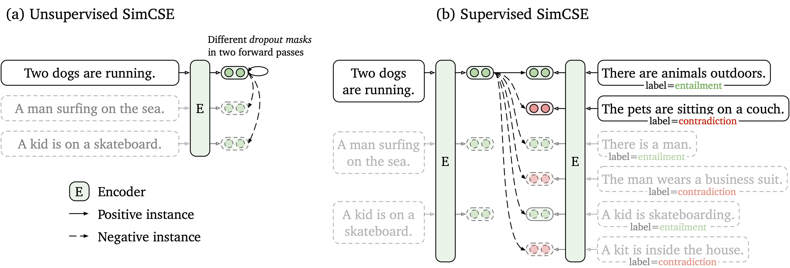

## Reproducibility Study of SimCSE: Simple Contrastive Learning of Sentence Embeddings

This repository contains the code and pre-trained models to replicate the paper [SimCSE: Simple Contrastive Learning of Sentence Embeddings](https://arxiv.org/abs/2104.08821). The code reused most of [the original code from the authors](https://github.com/princeton-nlp/SimCSE).

## Overview

The SimCSE paper proposes a simple contrastive learning framework that works with both unlabeled and labeled data. Unsupervised SimCSE simply takes an input sentence and predicts itself in a contrastive learning framework, with only standard dropout used as noise. Supervised SimCSE incorporates annotated pairs from NLI datasets into contrastive learning by using `entailment` pairs as positives and `contradiction` pairs as hard negatives. The following figure is an illustration of the models from the paper.



## File Structure (on top of authors' code)
`data` directory contains the scripts to download the data.

`cluster_exp_scripts` directory contains the scripts in order to run experiments on UW Hyak (`.slurm` files).

`local_exp_scripts` directory contains the scripts to run experiments on Linux device with `bash`.

`convert_anli_to_csv.py` contains the extra code to process the ANLI data.

`train.py` file is modified for us to reproduce the experiments.

## Getting Started

The authors provided their models on Huggingface. To use their models, run the following to install their pacakage.
```bash
python setup.py install
```

Note that if you want to enable GPU encoding, you should install the correct version of PyTorch that supports CUDA. See [PyTorch official website](https://pytorch.org) for instructions.

After installing the package, one can load the model by code below:
```python
from simcse import SimCSE
model = SimCSE("princeton-nlp/sup-simcse-bert-base-uncased")
```
See [model list](#model-list) for a full list of available models. 

## Model List

The authors' released models are listed as following. You can import these models by using the `simcse` package or using [HuggingFace's Transformers](https://github.com/huggingface/transformers). 
|              Model              | Avg. STS |
|:-------------------------------|:--------:|
|  [princeton-nlp/unsup-simcse-bert-base-uncased](https://huggingface.co/princeton-nlp/unsup-simcse-bert-base-uncased) |   76.25 |
| [princeton-nlp/unsup-simcse-bert-large-uncased](https://huggingface.co/princeton-nlp/unsup-simcse-bert-large-uncased) |   78.41  |
|    [princeton-nlp/unsup-simcse-roberta-base](https://huggingface.co/princeton-nlp/unsup-simcse-roberta-base)    |   76.57  |
|    [princeton-nlp/unsup-simcse-roberta-large](https://huggingface.co/princeton-nlp/unsup-simcse-roberta-large)   |   78.90  |
|   [princeton-nlp/sup-simcse-bert-base-uncased](https://huggingface.co/princeton-nlp/sup-simcse-bert-base-uncased)  |   81.57  |
|  [princeton-nlp/sup-simcse-bert-large-uncased](https://huggingface.co/princeton-nlp/sup-simcse-bert-large-uncased)  |   82.21  |
|     [princeton-nlp/sup-simcse-roberta-base](https://huggingface.co/princeton-nlp/sup-simcse-roberta-base)     |   82.52  |
|     [princeton-nlp/sup-simcse-roberta-large](https://huggingface.co/princeton-nlp/sup-simcse-roberta-large)    |   83.76  |

**Naming rules**: `unsup` and `sup` represent "unsupervised" (trained on Wikipedia corpus) and "supervised" (trained on NLI datasets) respectively.

## Train SimCSE

### Requirements

First, install PyTorch by following the instructions from [the official website](https://pytorch.org). To faithfully reproduce the results, please use the correct `1.7.1` version corresponding to your platforms/CUDA versions. PyTorch version higher than `1.7.1` should also work. For example, if you use Linux and **CUDA11** ([how to check CUDA version](https://varhowto.com/check-cuda-version/)), install PyTorch by the following command,

```bash
pip install torch==1.7.1+cu110 -f https://download.pytorch.org/whl/torch_stable.html
```

If you instead use **CUDA** `<11` or **CPU**, install PyTorch by the following command,

```bash
pip install torch==1.7.1
```


Then run the following script to install the remaining dependencies,

```bash
pip install -r requirements.txt
```

### Evaluation
The evaluation code for sentence embeddings is based on a modified version of [SentEval](https://github.com/facebookresearch/SentEval). It evaluates sentence embeddings on semantic textual similarity (STS) tasks and downstream transfer tasks. For STS tasks, the evaluation takes the "all" setting, and report Spearman's correlation. See [the original paper](https://arxiv.org/pdf/2104.08821.pdf) (Appendix B) for evaluation details.

Before evaluation, please download the evaluation datasets by running
```bash
cd SentEval/data/downstream/
bash download_dataset.sh
```

Then come back to the root directory, you can evaluate any `transformers`-based pre-trained models using the evaluation code. For example,
```bash
python evaluation.py \
    --model_name_or_path princeton-nlp/sup-simcse-bert-base-uncased \
    --pooler cls \
    --task_set sts \
    --mode test
```
which is expected to output the results in a tabular format:
```
------ test ------
+-------+-------+-------+-------+-------+--------------+-----------------+-------+
| STS12 | STS13 | STS14 | STS15 | STS16 | STSBenchmark | SICKRelatedness |  Avg. |
+-------+-------+-------+-------+-------+--------------+-----------------+-------+
| 75.30 | 84.67 | 80.19 | 85.40 | 80.82 |    84.26     |      80.39      | 81.58 |
+-------+-------+-------+-------+-------+--------------+-----------------+-------+
```

Arguments for the evaluation script are as follows,

* `--model_name_or_path`: The name or path of a `transformers`-based pre-trained checkpoint. You can directly use the models in the above table, e.g., `princeton-nlp/sup-simcse-bert-base-uncased`.
* `--pooler`: Pooling method. Now support
    * `cls` (default): Use the representation of `[CLS]` token. A linear+activation layer is applied after the representation (it's in the standard BERT implementation). If you use **supervised SimCSE**, you should use this option.
    * `cls_before_pooler`: Use the representation of `[CLS]` token without the extra linear+activation. If you use **unsupervised SimCSE**, you should take this option.
    * `avg`: Average embeddings of the last layer. If you use checkpoints of SBERT/SRoBERTa ([paper](https://arxiv.org/abs/1908.10084)), you should use this option.
    * `avg_top2`: Average embeddings of the last two layers.
    * `avg_first_last`: Average embeddings of the first and last layers. If you use vanilla BERT or RoBERTa, this works the best.
* `--mode`: Evaluation mode
    * `test` (default): The default test mode. To faithfully reproduce the results, you should use this option.
    * `dev`: Report the development set results. Note that in STS tasks, only `STS-B` and `SICK-R` have development sets, so only their numbers are reported. It also takes a fast mode for transfer tasks, so the running time is much shorter than the `test` mode (though numbers are slightly lower).
    * `fasttest`: It is the same as `test`, but with a fast mode so the running time is much shorter, but the reported numbers may be lower (only for transfer tasks).
* `--task_set`: What set of tasks to evaluate on (if set, it will override `--tasks`)
    * `sts` (default): Evaluate on STS tasks, including `STS 12~16`, `STS-B` and `SICK-R`. This is the most commonly-used set of tasks to evaluate the quality of sentence embeddings.
    * `transfer`: Evaluate on transfer tasks.
    * `full`: Evaluate on both STS and transfer tasks.
    * `na`: Manually set tasks by `--tasks`.
* `--tasks`: Specify which dataset(s) to evaluate on. Will be overridden if `--task_set` is not `na`. See the code for a full list of tasks.

### Training

**Data**

Run `data/download_wiki.sh` and `data/download_nli.sh` to download the two datasets that were used for supervised and unsupervised SimCSE.

**Training scripts**

The authors provide example training scripts for both unsupervised and supervised SimCSE. `run_unsup_example.sh` provide a single-GPU (or CPU) example for the unsupervised version, and `run_sup_example.sh` gives a **multiple-GPU** example for the supervised version. Both scripts call `train.py` for training. The arguments are the following:
* `--train_file`: Training file path. It can be either "txt" files (one line for one sentence) or "csv" files (2-column: pair data with no hard negative; 3-column: pair data with one corresponding hard negative instance). You can use our provided Wikipedia or NLI data, or you can use your own data with the same format.
* `--model_name_or_path`: Pre-trained checkpoints to start with. For now BERT-based models (`bert-base-uncased`, `bert-large-uncased`, etc.) and RoBERTa-based models (`RoBERTa-base`, `RoBERTa-large`, etc.) are supported.
* `--temp`: Temperature for the contrastive loss.
* `--pooler_type`: Pooling method. It's the same as the `--pooler_type` in the [evaluation part](#evaluation).
* `--mlp_only_train`: For unsupervised SimCSE, it works better to train the model with MLP layer but test the model without it. You should use this argument when training unsupervised SimCSE models.
* `--hard_negative_weight`: If using hard negatives (i.e., there are 3 columns in the training file), this is the logarithm of the weight. For example, if the weight is 1, then this argument should be set as 0 (default value).
* `--do_mlm`: Whether to use the MLM auxiliary objective. If True:
  * `--mlm_weight`: Weight for the MLM objective.
  * `--mlm_probability`: Masking rate for the MLM objective.

**Hyperparameters**

The following hyperparamters are used for training SimCSE:

|               | Unsup. BERT | Unsup. RoBERTa | Sup.      |
|:--------------|:-----------:|:--------------:|:---------:|
| Batch size    | 16          | 16            | 16       |
| Learning rate (base)  | 3e-5 | 1e-5 | 5e-5 |
| Learning rate (large) | 1e-5 | 3e-5 | 1e-5 |
